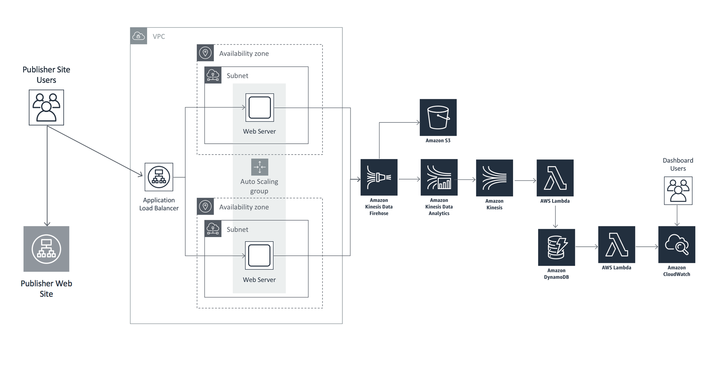
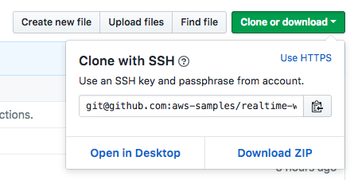
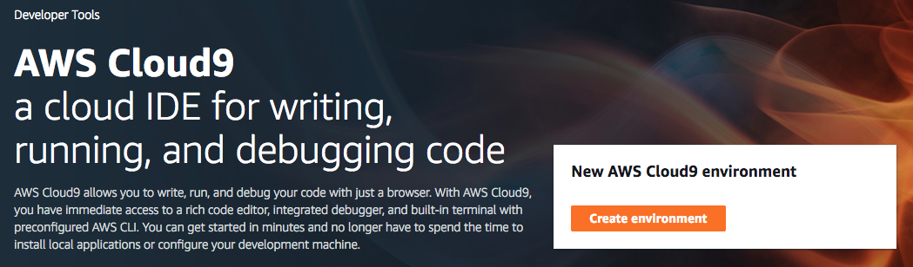
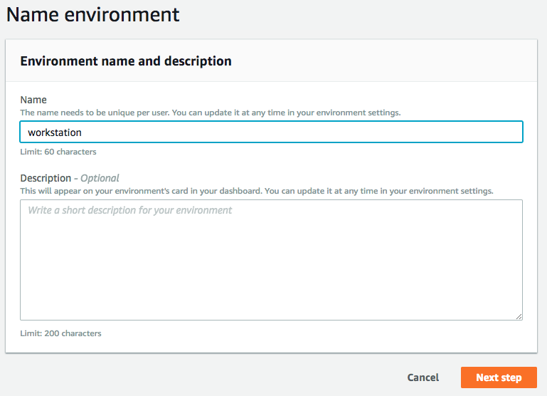
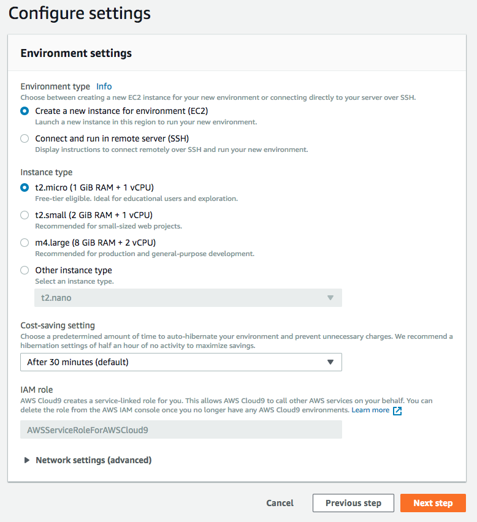
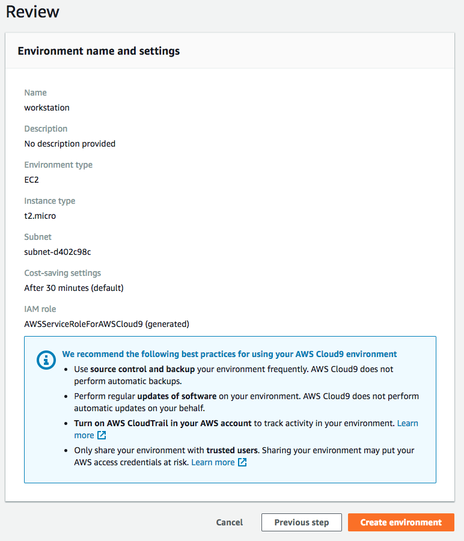
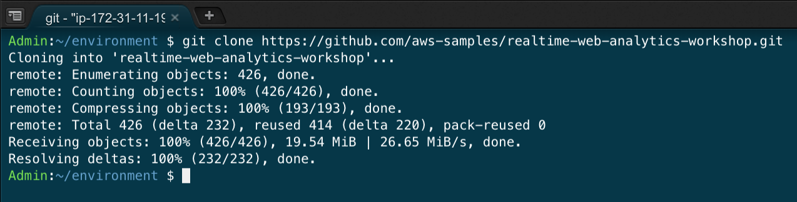

# AWS Realtime Web Analytics Workshop

## Introduction

Knowing what users are doing on your web sites in realtime gives you insights you can act on without having to wait for delayed batch processing of clickstream data.  There are many use cases for evaluating web traffic analytics in realtime: watching the immediate impact to user behavior after new releases, detecting and responding to anomalies, situational awareness, and evaluating trends are all benefits of having realtime web site analytics.

Build a cost optimized platform to capture web beacon traffic, analyze the traffic for interesting metrics, and display it on a customized dashboard.

<strong>Overview of completed solution (expand for details) </strong>

 

Simply clone this repository and start on module 1 below:

**Note:**  If you don't have python or git installed on your computer, I recommend that you use an [AWS Cloud9](https://aws.amazon.com/cloud9/) environment to clone the repository.  Expand the instructions below for details:

<strong>Cloud9 Environment Setup (expand for details)</strong>

### AWS Cloud9 Environment Setup Instructions

1.  Navigate in the AWS console to **Services**, then select **Cloud9**.  Be sure that you have either the **US East (N. Virginia)**, **US West (Oregon)**, or **EU West (Ireland)** region selected before you proceed to the next step.

2.  Click the **Create Environment** button:

3.  Give your Environment a name, then click the **Next step** button:

4.  The default Environment settings should be fine for this workshop (t2.micro instance type), which will allow you to stay within the free tier for your Cloud9 environment usage.  If you want to load test the solution from this environment, you may want to provision a larger instance type to increase the network bandwidth available to your environment:

5.  Review the Environment name and settings, then click the **Create environment** button to continue:

6.  Once your environment has started, you can open a Terminal to run the git clone command:

`git clone https://github.com/aws-samples/web-analytics.git`

